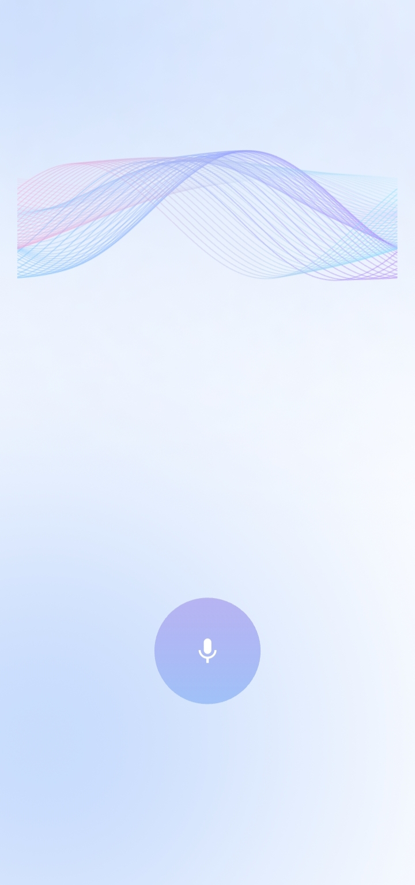
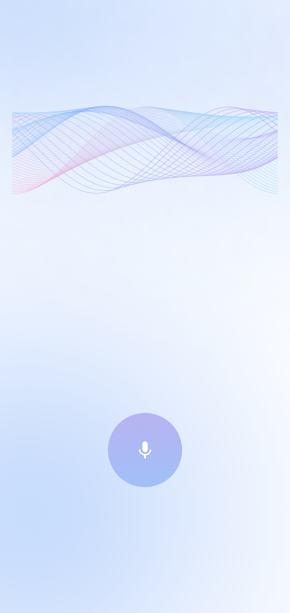

# wave_animation

A customizable **wave animation widget** for Flutter with null-safe options. Create beautiful, animated waves with multiple layers, gradient colors, and motion patterns.




## Features

- Multiple wave layers with customizable gradients
- Control amplitude, wave length, and speed
- Choose from 5 motion patterns:
  - `classic`
  - `flowField`
  - `ribbonDrift`
  - `flowFieldLoop`
  - `ribbonLoop`
- Visibility toggle
- Fully null-safe

## Installation

Add this to your `pubspec.yaml`:
```yaml
dependencies:
  wave_animation: ^1.0.3
```

Then run:
```bash
flutter pub get
```

## Usage

### Basic Example

Import the package and use the `WaveWidget`:
```dart
import 'package:flutter/material.dart';
import 'package:wave_animation/wave_animation.dart';

void main() {
  runApp(const WaveExampleApp());
}

class WaveExampleApp extends StatelessWidget {
  const WaveExampleApp({super.key});

  @override
  Widget build(BuildContext context) {
    return MaterialApp(
      title: 'Wave Animation Example',
      home: Scaffold(
        appBar: AppBar(title: const Text('Wave Animation Example')),
        body: Center(
          child: WaveWidget(
            height: 250,
            gradientColors1: [
              Colors.blue.withAlpha(40),
              Colors.lightBlueAccent.withAlpha(40),
            ],
            gradientColors2: [
              Colors.purple.withAlpha(50),
              Colors.pinkAccent.withAlpha(50),
            ],
            lineCount: 3,
            amplitude: 20,
            waveLength: 200,
            speed: 0.8,
            pattern: WaveMotionPattern.flowFieldLoop,
            visible: true,
          ),
        ),
      ),
    );
  }
}
```

## Parameters

| Parameter | Type | Default | Description |
|-----------|------|---------|-------------|
| `height` | `double` | **required** | Height of the wave widget |
| `gradientColors1` | `List<Color>` | **required** | Gradient colors for the first wave layer |
| `gradientColors2` | `List<Color>` | **required** | Gradient colors for the second wave layer |
| `lineCount` | `int` | `3` | Number of wave lines to draw (more lines = denser waves) |
| `amplitude` | `double` | `20.0` | Wave height (higher = taller waves) |
| `waveLength` | `double` | `200.0` | Distance between wave peaks (lower = more compressed) |
| `speed` | `double` | `1.0` | Animation speed multiplier (higher = faster) |
| `pattern` | `WaveMotionPattern` | `classic` | Motion pattern of the waves |
| `visible` | `bool` | `true` | Whether the wave is visible or not |

## Motion Patterns

Choose from 5 different wave motion patterns:

### 1. Classic
```dart
WaveWidget(
  pattern: WaveMotionPattern.classic,
  // ... other parameters
)
```
Simple horizontal wave motion - waves move smoothly from left to right.

### 2. Flow Field
```dart
WaveWidget(
  pattern: WaveMotionPattern.flowField,
  // ... other parameters
)
```
Dynamic flow-like motion with varying speeds across wave lines.

### 3. Ribbon Drift
```dart
WaveWidget(
  pattern: WaveMotionPattern.ribbonDrift,
  // ... other parameters
)
```
Smooth drifting motion like ribbons flowing in the wind.

### 4. Flow Field Loop
```dart
WaveWidget(
  pattern: WaveMotionPattern.flowFieldLoop,
  // ... other parameters
)
```
Flow field pattern that loops seamlessly.

### 5. Ribbon Loop
```dart
WaveWidget(
  pattern: WaveMotionPattern.ribbonLoop,
  // ... other parameters
)
```
Ribbon drift pattern with looping animation.

## Customization Examples

### Ocean Waves
```dart
WaveWidget(
  height: 300,
  gradientColors1: [
    Colors.blue.shade900.withAlpha(60),
    Colors.blue.shade400.withAlpha(60),
  ],
  gradientColors2: [
    Colors.cyan.shade700.withAlpha(50),
    Colors.cyan.shade300.withAlpha(50),
  ],
  lineCount: 5,
  amplitude: 30,
  waveLength: 180,
  speed: 0.6,
  pattern: WaveMotionPattern.classic,
)
```

### Sunset Waves
```dart
WaveWidget(
  height: 250,
  gradientColors1: [
    Colors.orange.shade800.withAlpha(70),
    Colors.deepOrange.shade400.withAlpha(70),
  ],
  gradientColors2: [
    Colors.pink.shade600.withAlpha(60),
    Colors.pink.shade300.withAlpha(60),
  ],
  lineCount: 4,
  amplitude: 25,
  waveLength: 220,
  speed: 0.5,
  pattern: WaveMotionPattern.ribbonDrift,
)
```

### Energetic Waves
```dart
WaveWidget(
  height: 200,
  gradientColors1: [
    Colors.green.shade700.withAlpha(80),
    Colors.lightGreen.shade300.withAlpha(80),
  ],
  gradientColors2: [
    Colors.teal.shade600.withAlpha(70),
    Colors.tealAccent.shade200.withAlpha(70),
  ],
  lineCount: 6,
  amplitude: 40,
  waveLength: 150,
  speed: 1.5,
  pattern: WaveMotionPattern.flowFieldLoop,
)
```

## Tips

- **Transparency**: Use `withAlpha()` to create semi-transparent waves for a layered effect
- **Line Count**: More lines (5-6) create denser, more detailed waves
- **Amplitude**: Adjust between 15-40 for natural-looking waves
- **Wave Length**: Lower values (120-180) create tighter waves, higher values (200-300) create smoother waves
- **Speed**: Use 0.5-1.0 for calm waves, 1.5-2.0 for energetic animations

## License

MIT License - see LICENSE file for details

## Contributing

Contributions are welcome! Please open an issue or submit a pull request.